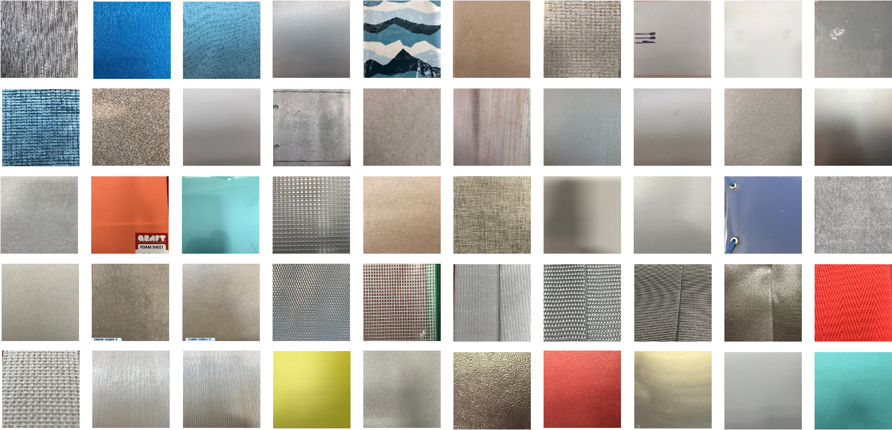

# Explainable and Sensor-Adaptable Recurrent Networks (ExSARN)
This repository contains tactile data and material description for texture classification, supplementary to the paper "On Explainability and Sensor-Adaptability of a Robot Tactile TextureRepresentation Using a Two-Stage Recurrent Networks", R. Gao et al., accepted to IROS 2021

For easy implementation, we only include the compiled dataset here in folder `data/`. The data collection process follows the setting in [Supervised Autoencoder Joint Learning on Heterogeneous Tactile Sensory Data](https://github.com/dexrob/Supervised-Autoencoder-Joint-Learning-on-Heterogeneous-Tactile-Sensory-Data) and more details about the robot arm and sensor specs can be found there.

## Dataset description
This dataset contains 50 classes. A snapshot of each corresponding material is shown below and the detailed description for each material can be found in `docs/material_properties_c50.docx` text file. Materials are named by `Matx`, where `x` is an index number ranging from 1 to 50. They are arranged from left to right, top to bottom in snapshots. Note that labels in datasets are reduced by 1 so that labels start from index 0 for programming purpose.

<br/>

We store the data in Google Drive. You can either download the data directly from [Google Drive](https://drive.google.com/drive/folders/1oDegTXkPEdRmIgA-b69fs60qJlSlxjGG?usp=sharing) or use the provided scripts to fetch it conveniently from terminal. Once cloning this repository, please do the following: <br/>
1. Modify the dir of "data_temp" to the desired directory
2. Set `fetch_data.sh` runnable by `chmod +x fetch_data.sh`
3. Set Python script `gdrivedl.py` as runnable program
4. In terminal, run `./fetch_data.sh` to download tactile data from Google Drive

The data set is ready for quick implementation in PyTorch. The data can be loaded with following commands
```
import torch
from preprocess_data import*

args_data_dir = 'data/'
data_folder = "c20/"
dataset_dir = os.path.join(args_data_dir, data_folder)
batch_size = 32
shuffle = True
prefix = ""
sequence_length = 75 if data_folder=="c20icub/" else 400
data_type = "I" if data_folder=="c20icub/" else "B"
train_loader, val_loader, test_loader = get_TrainValTestLoader(dataset_dir, k=0, batch_size=batch_size,shuffle=shuffle, prefix=prefix,seq_len=sequence_length, data_type=data_type)

'''epoch and model setting here'''

for i, (x,  y) in enumerate(train_loader):
    '''model training here'''

```


